# Ticket Creation Rule

**Version:** 7.0  
**Last Updated:** November 17, 2025  
**Owner:** Development Operations Team

## Purpose
This rule provides comprehensive workflow guidance for creating high-quality tickets with advanced context integration, template selection, and project-specific requirements for development teams across any ticket service platform.

## Instructions
- ALWAYS follow the exact workflow sequence defined in Section 3.1 without deviation (ID: FOLLOW_WORKFLOW_SEQUENCE)
- ALWAYS use the exact question formats specified for each step (ID: USE_EXACT_QUESTIONS)
- ALWAYS wait for user input at every designated "ALWAYS ask" point (ID: WAIT_FOR_INPUT)
- ALWAYS assess ticket requirements and select appropriate template based on ticket type (development, spike, bug, etc.) (ID: ASSESS_REQUIREMENTS)
- ALWAYS incorporate context from existing tickets, Confluence pages, or referenced sources when available (ID: INCORPORATE_CONTEXT)
- ALWAYS use available tooling to retrieve related ticket information for context integration (ID: USE_AVAILABLE_TOOLS)
- ALWAYS ensure tickets meet project-specific requirements (AA, AAA, AGG standards) (ID: PROJECT_STANDARDS)
- ALWAYS include clear acceptance criteria with testable conditions (ID: ACCEPTANCE_CRITERIA)
- ALWAYS assign appropriate priority, labels, and components based on ticket content (ID: ASSIGN_METADATA)
- ALWAYS read agent configurations from `/context/config/agent-config.yaml` for field mappings and issue types (ID: READ_AGENT_CONFIG)
- ALWAYS use YAML-defined agent configurations for ticket creation (ID: USE_AGENT_CONFIG)
- ALWAYS refer to service-specific instructions in service-instructions.md for platform integration details (ID: USE_SERVICE_INSTRUCTIONS)
- ALWAYS validate ticket completeness before creation using quality checklist (ID: VALIDATE_COMPLETENESS)
- When leveraging spike outcomes, ALWAYS reference findings and recommendations in ticket description (ID: SPIKE_INTEGRATION)
- When creating development tasks, ALWAYS break down complex work into manageable subtasks (ID: BREAK_DOWN_TASKS)

## Priority
High

## Error Handling
- If available tooling is unavailable, proceed with manual context gathering and note limitation
- If agent configurations are unavailable, use embedded fallback values and note limitation
- If service-instructions.md is unavailable, use generic integration approaches and note limitation
- If acceptance criteria are vague, work with user to clarify and make testable
- If ticket creation fails, provide manual creation template with all gathered information

## Intended Audience

- **Primary:** Development teams creating tickets
- **Secondary:** Product managers, technical writers
- **Prerequisites:** Basic ticket system knowledge, access to integration tools (optional)

## When to Use This Guide

- Creating new development tasks
- Incorporating context from existing tickets
- Standardizing ticket quality across teams
- Leveraging spike outcomes and research findings

## Scope

**Includes:**

- Ticket creation workflows with context integration
- Template selection and customization
- Integration with existing tickets and documentation pages
- Project-specific requirements (AA, AAA, AGG)

**Excludes:**

- Ticket management and workflow transitions
- Advanced ticket system administration
- Custom field configuration

## Workflow Steps

### 1. Requirements Assessment
- Identify ticket type (Story, Task, Bug, Spike, Epic)
- Determine project context (AA, AAA, AGG)
- Gather initial requirements and scope

### 2. Context Integration
- Search for related existing tickets
- Review referenced Confluence pages
- Incorporate spike findings if applicable
- Identify dependencies and blockers

### 3. Template Selection
- Choose appropriate template based on ticket type
- Customize template for specific project requirements
- Ensure all required fields are addressed

### 4. Quality Validation
- Review acceptance criteria for testability
- Verify all project standards are met
- Check for completeness and clarity
- Validate metadata assignments

### 5. Ticket Creation
- Use available tooling for automated creation when possible
- Apply appropriate labels, components, and priority
- Link to related tickets and documentation
- Assign to appropriate team member if known

## Agent Configuration

Agent behavior and supported projects are defined in `/context/config/agent-config.yaml`. The configuration specifies:

- Supported projects and their field requirements
- Custom field mappings and available options
- Issue type definitions and template associations
- Agent-specific validation rules

### Configuration Structure
The agent configuration defines:
- **Projects**: Supported project codes and their requirements
- **Custom Fields**: Field IDs, required status, and available option values
- **Issue Types**: Supported types, associated templates, and requirements
- **Validation Rules**: Agent-specific requirements and constraints

**Excludes:**

- Ticket system administration and project setup
- Custom field configuration
- User permission management

---

## 1. Getting Started

### 1.1 Prerequisites: Tool Availability Check

Before starting the ticket creation process, verify available capabilities:

**With Ticket Service Integration Available:**

- Read referenced tickets and linked issues
- Read documentation pages from integrated services
- Direct ticket creation and updates
- Project validation and issue type retrieval

**Without Integration Tools:**

- Ticket templates can still be generated
- User must manually copy content into ticket system
- Referenced sources cannot be automatically read
- Tickets saved locally in markdown format

### 1.2 Initial Information Collection

When user requests ticket creation, collect:

- **Title:** Concise summary of the change or update
- **Spike Outcome:** Key findings or outcomes from research (if applicable)

**Example Title:** "Update MR Process with Additional Information for Contributing Engineers"

**Example Spike Outcome:** "Build a thorough review checklist for datagraph engineers to ensure consistency in future reviews."

---

## 2. System Behaviours and Constraints

### 2.1 Workflow Compliance

- ALWAYS follow the step-by-step process exactly as defined in Section 3.1 (ID: FOLLOW_EXACT_PROCESS)
- ALWAYS complete each step fully before proceeding to the next (ID: COMPLETE_STEPS_SEQUENTIALLY)
- ALWAYS use the exact question formats specified for each step (ID: USE_EXACT_QUESTION_FORMATS)
- ALWAYS wait for user input at every designated input point (ID: WAIT_FOR_USER_INPUT)
- DON'T skip, combine, or reorder steps (ID: NO_STEP_MODIFICATIONS)
- DON'T modify question phrasing or format (ID: NO_QUESTION_MODIFICATIONS)
- NEVER improvise additional steps not specified in this document (ID: NO_IMPROVISED_STEPS)
- NEVER proceed without user confirmation at mandatory wait points (ID: REQUIRE_USER_CONFIRMATION)

### 2.2 Question and Response Handling  

- ALWAYS use only the exact question formats specified in each step (ID: EXACT_QUESTION_FORMATS_ONLY)
- ALWAYS wait for user response at every "ALWAYS ask" instruction (ID: WAIT_FOR_RESPONSES)
- ALWAYS accept simple responses (Y/N, numbers) without asking for elaboration (ID: ACCEPT_SIMPLE_RESPONSES)
- DON'T ask follow-up questions on standard confirmation responses (ID: NO_FOLLOWUP_ON_CONFIRMATIONS)
- DON'T deviate from specified question text (ID: NO_QUESTION_DEVIATION)
- NEVER prompt for information not requested in the current step (ID: NO_UNREQUESTED_PROMPTS)
- NEVER combine multiple questions into a single prompt (ID: NO_COMBINED_QUESTIONS)

### 2.3 Template and Process Adherence

- ALWAYS use only templates defined in Section 4 (ID: USE_DEFINED_TEMPLATES)
- ALWAYS apply language guidelines from Section 5 (ID: APPLY_LANGUAGE_GUIDELINES)
- ALWAYS follow the exact sequence defined in Section 3.1 (ID: FOLLOW_EXACT_SEQUENCE)
- DON'T modify or improvise template content (ID: NO_TEMPLATE_MODIFICATIONS)
- DON'T change the order of workflow steps (ID: NO_STEP_REORDERING)
- NEVER bypass quality assurance requirements from Section 6 (ID: NO_QA_BYPASS)

### 2.4 Tool Availability and Capability Assessment

- ALWAYS check what tools are available before starting the workflow (ID: CHECK_TOOL_AVAILABILITY)
- ALWAYS inform user of available capabilities based on tool access (ID: INFORM_CAPABILITIES)
- ALWAYS adapt functionality based on available tools (full vs limited mode) (ID: ADAPT_TO_TOOLS)
- ALWAYS skip Step 7 entirely if integration tools are not available (ID: SKIP_STEP7_NO_TOOLS)
- DON'T assume tool availability without verification (ID: NO_TOOL_ASSUMPTIONS)

### 2.5 Context Integration

- ALWAYS read referenced sources only when explicitly requested by user (ID: READ_ON_REQUEST_ONLY)
- ALWAYS use available tooling as specified for ticket system and documentation integration (ID: USE_AVAILABLE_TOOLING)
- ALWAYS follow the exact sequence in Step 2 for supporting documentation (ID: FOLLOW_STEP2_SEQUENCE)
- DON'T assume user intent for context integration (ID: NO_INTENT_ASSUMPTIONS)
- DON'T automatically process supporting documentation (ID: NO_AUTO_PROCESSING)
- NEVER proceed with source reading without user confirmation (ID: REQUIRE_READ_CONFIRMATION)

---

## 3. Core Workflow

### 3.1 Basic Ticket Creation Process

#### Step 1: Mandatory Information Collection

ALWAYS ask for the following information in this exact order:

1. **Title Collection:**
   - ALWAYS ask: "What is the title for your ticket?"
   - ALWAYS wait for user response before proceeding

2. **Spike Information Collection:**
   - ALWAYS ask: "Do you have any spike outcome or context to include?"
   - ALWAYS wait for user response before proceeding
   - Accept "no", "n", or specific spike information

#### Step 2: Supporting Documentation Collection

ALWAYS perform this step in the exact sequence:

1. **Supporting Documentation Question:**
   - ALWAYS ask: "Do you have any further supporting documentation?"
   - ALWAYS wait for user response before proceeding
   - Accept "no", "n", or links/references to documentation

2. **Context Integration Decision (Only if documentation provided):**
   - ALWAYS ask: "Are you simply referencing these for context, OR using these to build the content of the new ticket?"
   - ALWAYS wait for user response before proceeding

3. **Source Reading Confirmation (Only if building content):**
   - ALWAYS ask: "Would you like me to read these sources and incorporate their context into the ticket?"
   - ALWAYS wait for user response before proceeding

#### Step 3: Ticket Generation

- Use appropriate project-specific template
- ALWAYS render preview as plain text for the user, with section headers styled as H2 (e.g., '## Section Name') (ID: RENDER_PLAIN_TEXT_PREVIEW)
- ALWAYS exclude markdown syntax such as code blocks, backticks, or formatting tags in the preview (ID: EXCLUDE_MARKDOWN_SYNTAX)
- Present the complete ticket template to user

#### Step 4: Review and Refinement

ALWAYS perform this step with exact question format:

1. **Change Request:**
   - ALWAYS ask: "Any changes required?"
   - ALWAYS wait for user response before proceeding
   - If changes requested, make modifications and repeat this step
   - If no changes, proceed to final confirmation

2. **Final Confirmation:**
   - ALWAYS ask: "Are you happy to proceed?"
   - ALWAYS wait for user response before proceeding
   - Accept "Yes", "Y", "yes", "y" to proceed
   - If not confirmed, return to change request

#### Step 5: Issue Type and Type of Work Selection

ALWAYS collect required fields in this exact sequence:

1. **Issue Type Selection:**
   - ALWAYS ask: "Please select the issue type:"
   - ALWAYS present numbered list of available types from agent configuration
   - ALWAYS wait for user response (number selection) before proceeding

2. **Type of Work Selection (Only if required by project):**
   - ALWAYS ask: "Please select the type of work:"
   - ALWAYS present numbered list of available options from agent configuration
   - ALWAYS wait for user response (number selection) before proceeding

#### Step 6: Creation Confirmation

ALWAYS perform this confirmation step:

- ALWAYS ask: "Are you happy to create the ticket?"
- ALWAYS wait for user response before proceeding
- Accept "Yes", "Y", "yes", "y" to proceed

#### Step 7: Ticket Selection (Only if Integration Tools Available)

ALWAYS perform this step only if ticket service integration tools are available (ID: PERFORM_ONLY_WITH_TOOLS)
ALWAYS skip this step and proceed directly to local file save if tools are NOT available (ID: SKIP_WITHOUT_TOOLS)

ALWAYS ask with exact format:
- ALWAYS ask: "Would you like to provide an existing Ticket ID/Key to update, OR create a new ticket?"
- ALWAYS wait for user response before proceeding
- Accept ticket ID/key for updates or "new"/"create new" for new tickets

#### Step 8: Project Key Validation (New Tickets Only)

For new tickets, ALWAYS perform in this exact sequence:

1. **Project Key Request:**
   - ALWAYS ask: "What is the project key? (e.g., AAA, AA)"
   - ALWAYS wait for user response before proceeding

2. **Project Validation:**
   - Retrieve and display project details using available tools
   - ALWAYS ask: "Is this the expected project for your ticket?"
   - ALWAYS wait for user confirmation before proceeding
   - If not confirmed, return to project key request

### 3.2 Advanced Context Integration

#### Referenced Ticket Analysis

When tickets are referenced:

**Process:**

1. **Read Referenced Ticket:** Use available tools to retrieve full details
2. **Read Linked Tickets:** Use available tools to get related tickets (depth of 1)
3. **Extract Context:** Analyze for:
   - Problem context and background
   - Technical requirements and constraints
   - Business objectives and outcomes
   - Dependencies and relationships
   - Lessons learned or spike findings

#### Documentation Page Analysis

When documentation pages are referenced:

**Process:**

1. **Read Referenced Page:** Use available tools for full content
2. **Read Related Pages:** Use available tools for child pages
3. **Extract Context:** Analyze for:
   - Documentation and specifications
   - Design decisions and rationale
   - Implementation guidelines and standards
   - Process workflows and procedures
   - Historical context and lessons learned

#### Context Integration Application

Use gathered information to enhance:

- **Background/Context:** Include relevant details from referenced tickets
- **Business/Customer Value:** Leverage insights from related work
- **Acceptance Criteria:** Build upon previous requirements and learnings
- **Dependencies:** Reference related tickets and their outcomes
- **Consistency:** Align with established patterns and decisions

**Example Workflow:**

```
User mentions: "Based on AAA-915 findings..."
1. Read AAA-915 using available tools
2. Read any tickets linked to AAA-915
3. Extract key findings, requirements, and context
4. Incorporate insights into the new ticket template
5. Reference the source tickets in appropriate sections
```

---

## 4. Templates & References

⚠️ **Note:** Templates are stored in markdown format for consistency and reuse. However, during Step 3 (Ticket Generation), the preview shown to the user should be rendered as plain text — without markdown syntax.

### 4.0 Template Variable Format

All templates use curly bracket notation `{variable_name}` for dynamic content substitution:

- `{title}` - Ticket title
- `{description}` - Main description content
- `{acceptance_criteria}` - Testable acceptance criteria
- `{business_value}` - Business impact and value
- `{customer_value}` - Customer-facing benefits
- `{background_context}` - Background information and context
- `{demo_scenario}` - How to demonstrate the completed work
- `{engineering_notes}` - Technical implementation details
- `{dependencies}` - Related tickets and dependencies
- `{ui_elements}` - User interface considerations
- `{po_testing}` - Product owner testing requirements

Templates automatically populate these variables during ticket generation based on user input and context integration.

### 4.1 Project-Specific Templates

Templates are now stored as individual files in `/context/templates/` following the `{PROJECT}_{TYPE}` naming convention:

#### Available Templates
- **AA_TASK.md** - Application Architecture task template
- **AAA_TASK.md** - AAA project task template  
- **AAA_EPIC.md** - AAA project epic template
- **AAA_DAILY-DETECTIVE.md** - AAA daily detective workflow template
- **AGG_HELLO-WORLD.md** - Application Governance Guidelines onboarding template

#### Template Discovery
Templates are automatically discovered from the `/context/templates/` directory. The agent dynamically identifies available ticket types based on existing template files, enabling seamless addition or removal of templates without workflow modifications.

#### Template Naming Convention
- **PROJECT**: Capitalised project code (e.g., AA, AAA, MY-PROJECT)
- **TYPE**: Uppercase ticket type (e.g., TASK, EPIC, HELLO-WORLD)  
- **Separator**: Underscore between PROJECT and TYPE
- **Hyphens**: Allowed in both PROJECT and TYPE components

### 4.2 Agent Configuration

Agent behavior is defined in `/context/config/agent-config.yaml`:

#### Configuration Format
```yaml
projects:
  PROJECT_CODE:
    name: "Project Name"
    description: "Project requirements description"
    custom_fields:
      field_name:
        field_id: "customfield_xxxxx"
        required: true/false
        options:
          - id: option_id
            value: "Option Value"
    issue_types:
      - name: "Issue Type Name"
        template: "TEMPLATE_NAME"
        type_of_work_required: true/false
        notes: "Additional notes"
```

#### Dynamic Field Handling
- Custom field requirements are read from YAML configuration
- Available options are presented based on project selection
- Field IDs and option values are used for ticket service integration
- Template selection is based on issue type configuration

### 4.3 Project Requirements Matrix

Agent requirements are dynamically loaded from `/context/config/agent-config.yaml`. The configuration defines:

- **Supported Issue Types**: Available ticket types per project
- **Template Mappings**: Which template file to use for each issue type
- **Custom Field Requirements**: Required fields and their available options
- **Validation Rules**: Project-specific constraints and requirements

Refer to the YAML configuration file for current project definitions, supported issue types, and field mappings.

---

## 5. Language and Style Guidelines

### 5.1 Content Formatting Requirements

#### Business Language Usage

- ALWAYS use business-appropriate language throughout all ticket content (ID: USE_BUSINESS_LANGUAGE)
- ALWAYS avoid technical jargon in user-facing sections (User Story, Business Value, Customer Value) (ID: AVOID_TECHNICAL_JARGON)
- ALWAYS use clear, accessible terminology that stakeholders across different roles can understand (ID: USE_ACCESSIBLE_TERMINOLOGY)
- ALWAYS translate technical concepts into business impact and value statements (ID: TRANSLATE_TECHNICAL_CONCEPTS)
- ALWAYS maintain professional tone while being conversational and engaging (ID: MAINTAIN_PROFESSIONAL_TONE)

**Examples of Business Language:**
- Instead of: "Refactor authentication middleware"
- Use: "Improve system security and user login experience"

- Instead of: "Implement caching layer optimization"  
- Use: "Reduce page load times to improve user satisfaction"

#### Language Standard

- ALWAYS use British English for all ticket content (ID: USE_BRITISH_ENGLISH)
- Examples: "optimise" not "optimize", "colour" not "color", "realise" not "realize"

#### Business Value and Customer Value Sections

- ALWAYS start with paragraph text before any bullet points (ID: START_WITH_PARAGRAPH)
- Provide context and explanation in prose format first
- Bullet points can be used after the initial paragraph for additional details

#### Lead-in Requirements for Mixed Content

- ALWAYS include a lead-in or introductory sentence/phrase when paragraph text precedes bullet points within the same section (ID: INCLUDE_LEADINS)
- Examples of proper lead-ins:
  - "This includes the following benefits:"
  - "Key improvements will be:"
  - "The main areas of impact are:"
  - "This will result in:"

**Example format:**

```markdown
## Business value

This change will improve our operational efficiency by reducing manual processes and enabling faster response times. The automation will save approximately 2 hours per day across the team.

Key benefits include:
- Reduced manual effort
- Faster processing times
- Improved accuracy
```

#### User Story Format

- Use soft returns (line breaks) between the three lines:

  ```markdown
  As a …  
  I want …  
  So that …
  ```

#### Acceptance Criteria

- Use clear, testable statements
- Prefer GIVEN/WHEN/THEN format for complex scenarios
- ALWAYS use soft returns (line breaks) within GIVEN/WHEN/THEN blocks (ID: USE_SOFT_RETURNS_BLOCKS)
- ALWAYS use normal returns after each complete scenario (ID: USE_NORMAL_RETURNS_SCENARIOS)
- Use simple bullet points for straightforward requirements

**Example format:**

```markdown
## Acceptance Criteria

GIVEN I am a logged-in user  
WHEN I click the submit button  
THEN the form should be validated

GIVEN the form contains errors  
WHEN I attempt to submit  
THEN error messages should be displayed
```

### 5.2 Writing Style

- **Be specific and actionable** - avoid vague language
- **Use present tense** for current state, future tense for desired outcomes
- **Include measurable outcomes** where possible
- **Reference related work** when building on previous tickets or spikes

---

## 6. Quality Assurance

### 6.1 Validation Checklist

Before creating a ticket, ensure:

- [ ] Title clearly describes the work
- [ ] British English is used throughout (optimise, colour, realise, etc.) (ID: BRITISH_ENGLISH_VALIDATION)
- [ ] Business language is used appropriately (accessible to all stakeholders) (ID: BUSINESS_LANGUAGE_VALIDATION)
- [ ] Technical concepts translated to business impact where applicable (ID: TECHNICAL_TRANSLATION_VALIDATION)
- [ ] Business value and Customer value start with paragraph text (ID: PARAGRAPH_START_VALIDATION)
- [ ] Lead-in sentences precede bullet points in mixed content sections (ID: LEADIN_VALIDATION)
- [ ] User story uses soft returns between lines
- [ ] Acceptance criteria use soft returns within GIVEN/WHEN/THEN blocks (ID: SOFT_RETURNS_VALIDATION)
- [ ] Normal returns separate each acceptance criteria scenario (ID: NORMAL_RETURNS_VALIDATION)
- [ ] Acceptance criteria are testable
- [ ] Preview shown to user is plain text (no markdown syntax) (ID: PLAIN_TEXT_PREVIEW_VALIDATION)
- [ ] Dependencies are identified
- [ ] Appropriate template is used
- [ ] Context sources are properly referenced
- [ ] Type of Work is selected (if required by agent configuration)
- [ ] Project key is validated

### 6.2 Success Criteria

Before creating a ticket, ensure:

- [ ] Title clearly describes the work
- [ ] Acceptance criteria are testable
- [ ] Dependencies are identified
- [ ] Appropriate template is used
- [ ] Context sources are properly referenced
- [ ] Type of Work is selected (if required by agent configuration)
- [ ] Project key is validated


---

## 7. Process Flow Reference

```mermaid
flowchart TD
    A["User: Create a Ticket"] --> B{Check Integration Tools Available?}
    
    B -->|Yes| C[Full Functionality Available]
    B -->|No| D[Limited Functionality - Local Save Only]
    
    C --> E[Step 1: Collect Title & Spike Info]
    D --> E
    
    E --> F[Step 2: Further Research]
    F --> F1{Do you have any further supporting documentation?}
    F1 -->|No/N| K[Step 3: Generate Ticket Template]
    F1 -->|Yes - Sources Provided| G[Identify Source Types]
    
    G --> H{Reference or Build Content?}
    H -->|Reference Only| K
    H -->|Build Content| I{Read Sources?}
    
    I -->|No| K
    I -->|Yes| J[Read Sources with Available Tools]
    
    J --> J1[Tickets: Read using available tools]
    J --> J2[Documentation: Read using available tools]
    J --> J3[External Sources: Web Scraping Tools]
    
    J1 --> J4[Extract & Apply Context]
    J2 --> J4
    J3 --> J4
    
    J4 --> K[Step 3: Generate Ticket Template]
    
    K --> K1[Step 4: Review and Refinement]
    K1 --> K2{Any Changes Required?}
    K2 -->|Yes| K1
    K2 -->|No| K3{Are you happy to proceed?}
    K3 -->|No| K1
    K3 -->|Yes/Y| L[Step 5: Issue Type & Type of Work Selection]
    
    L --> M[Present Options from Agent Configuration]
    
    M --> N[Step 6: User Confirmation]
    N --> O{Happy to Create?}
    O -->|No| K1
    O -->|Yes| Z{Integration Tools Available?}
    
    Z -->|Yes| P[Step 7: Ticket Selection]
    Z -->|No| BB[Save Locally as Markdown]
    
    P --> Q{Update Existing or Create New?}
    Q -->|Update Existing| R[Provide Ticket ID/Key]
    Q -->|Create New| S[Step 8: Project Key Validation]
    
    S --> T[Ask for Project Key]
    T --> U[Use Available Tools: Get Project Details]
    U --> V[Display Project Info]
    V --> W{Correct Project?}
    W -->|No| T
    W -->|Yes| X[Create Ticket with Available Tools]
    
    R --> Y[Update Ticket with Available Tools]
    
    X --> AA[Direct Ticket Creation/Update]
    Y --> AA
    
    AA --> CC[Success: Ticket Created/Updated]
    BB --> DD[Success: Local File Saved]
    
    style A fill:#e1f5fe
    style C fill:#c8e6c9
    style D fill:#ffecb3
    style F fill:#e8f5e8
    style F1 fill:#e8f5e8
    style K1 fill:#fff3e0
    style K2 fill:#fff3e0
    style K3 fill:#fff3e0
    style Z fill:#fce4ec
    style J1 fill:#f3e5f5
    style J2 fill:#f3e5f5
    style J3 fill:#f3e5f5
    style U fill:#f3e5f5
    style AA fill:#c8e6c9
    style BB fill:#ffecb3
```



---

## Related Contexts
- [templates.md](./templates.md) (ID: TEMPLATE_ARCHITECTURE)
- [service-instructions.md](./service-instructions.md) (ID: SERVICE_INTEGRATION)

## Document Control

### Ownership & Maintenance

- **Last Review:** August 5, 2025
- **Next Review:** September 4, 2025

### Change Log

| Version | Date | Changes | Author |
|---------|------|---------|--------|
| 7.0 | November 17, 2025 | Standardized workflow with exact question formats, mandatory user input points, and consistent step sequencing for automation testing reliability | Development Operations Team |
| 6.7 | November 16, 2025 | Fixed templates.md cross-reference to use relative path for deployment | Development Operations Team |
| 6.6 | November 15, 2025 | Removed internal development references, cleaned up cross-references for production deployment | Development Operations Team |
| 6.5 | November 15, 2025 | Removed redundant Quality Checklist section, consolidated validation into comprehensive Validation Checklist | Development Operations Team |
| 6.4 | November 15, 2025 | Added service-instructions.md error handling for improved robustness | Development Operations Team |
| 6.3 | November 15, 2025 | Consolidated duplicate Related Contexts sections, improved document structure | Development Operations Team |
| 6.2 | November 15, 2025 | Added service-specific instructions reference, restored platform-specific terminology with service instruction delegation | Development Operations Team |
| 6.1 | November 15, 2025 | Fixed service-agnostic terminology, updated process flow, removed duplicate sections, added business language guidelines | Development Operations Team |
| 6.0 | November 15, 2025 | Made ticket system agnostic, extracted templates to separate files, updated to service-agnostic approach | Development Operations Team |
| 5.0 | September 29, 2025 | Major restructure: improved information architecture, added governance, enhanced clarity and navigation | Development Operations Team |
| 4.0 | August 4, 2025 | Added context integration capabilities | Development Operations Team |
